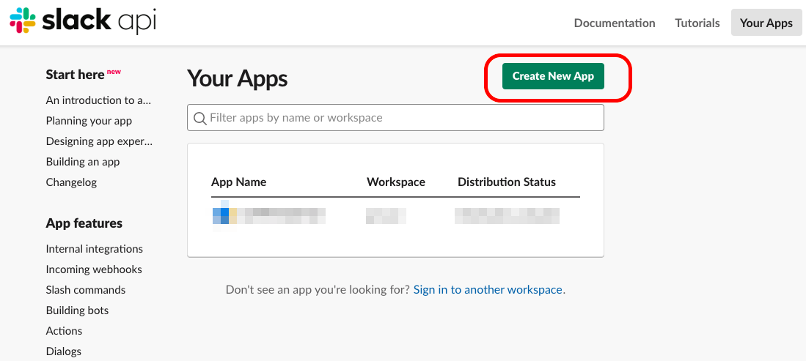
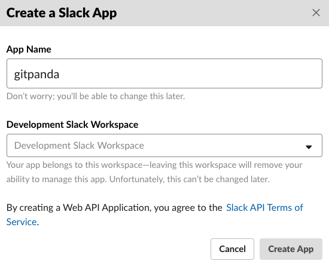
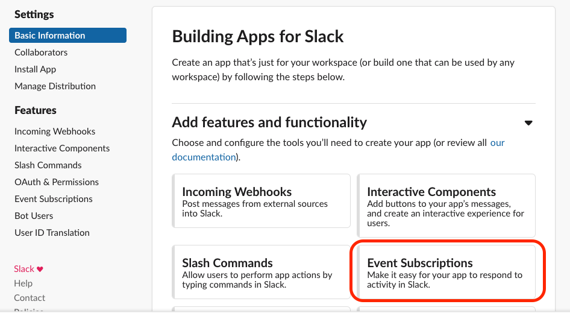
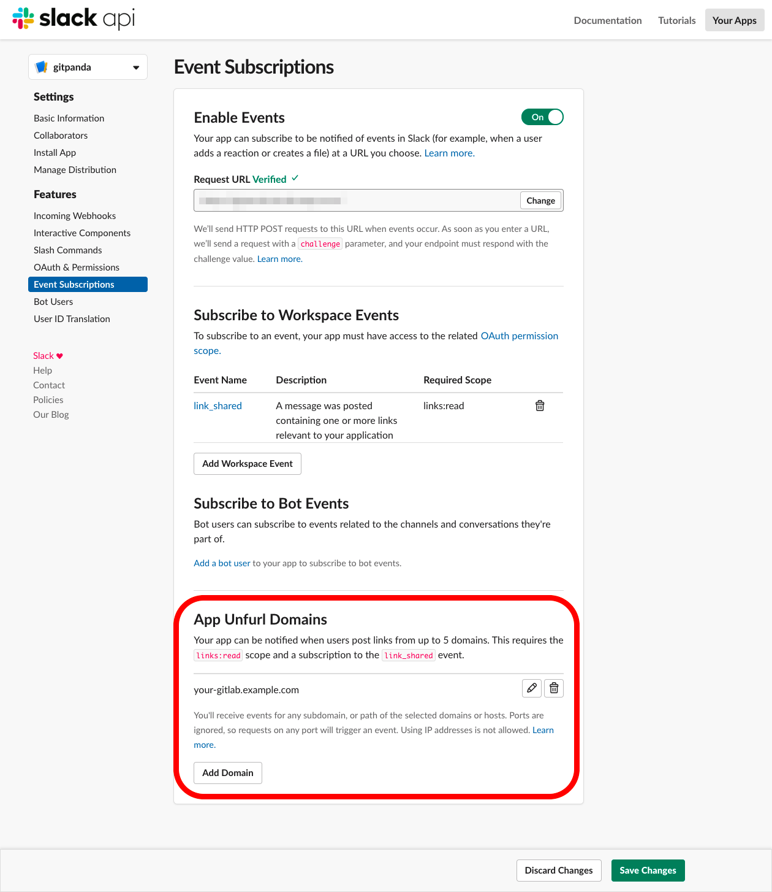
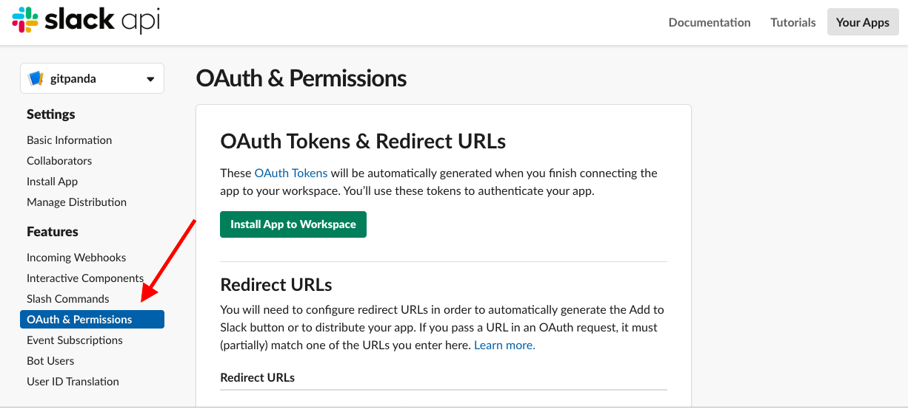
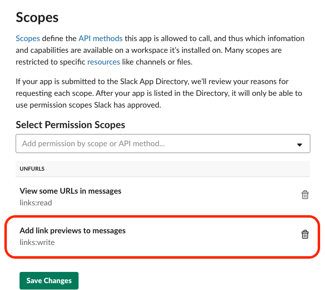
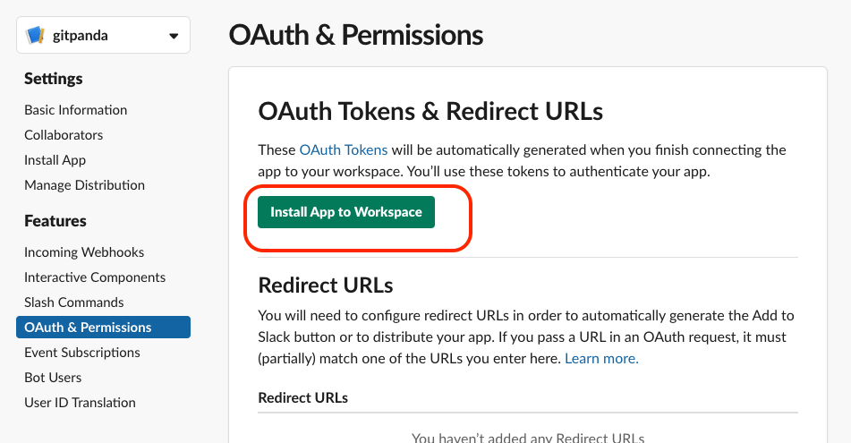
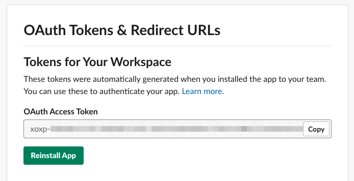
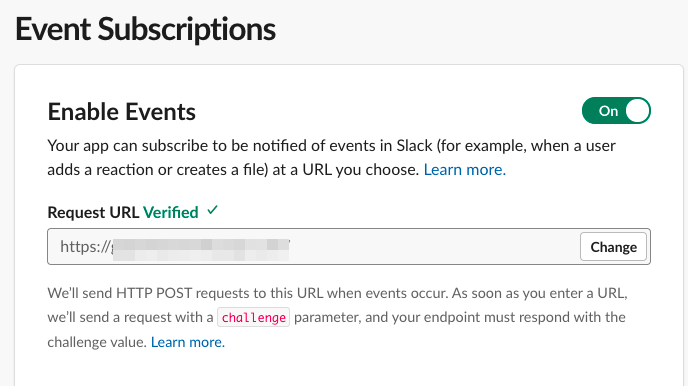

# Create Slack App
## 1. Go to https://api.slack.com/apps and click "Create New App"

## 2. Create a Slack app

## 3. Go to "Basic Information" and click "Event subscriptions"

## 4. Add Unfurl domains
Register your GitLab domain (e.g. `your-gitlab.example.com`)

And Click "Save Changes"

## 5. Go to "OAuth & Permissions"

## 6. Register `links:write` to Scopes

## 7. Click "Install App to Workspace"

## 8. Copy OAuth Access Token

## 9. Deploy gitpanda to server

## 10. Register gitpanda URL

